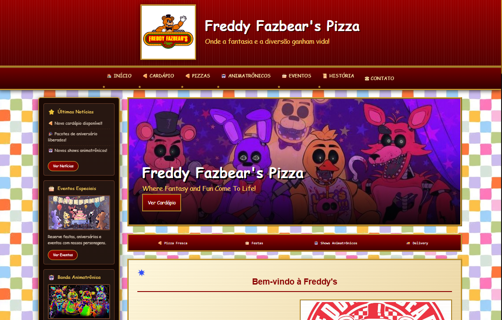
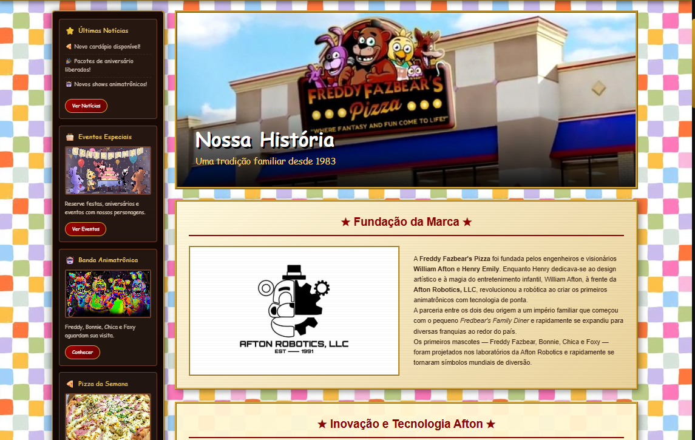
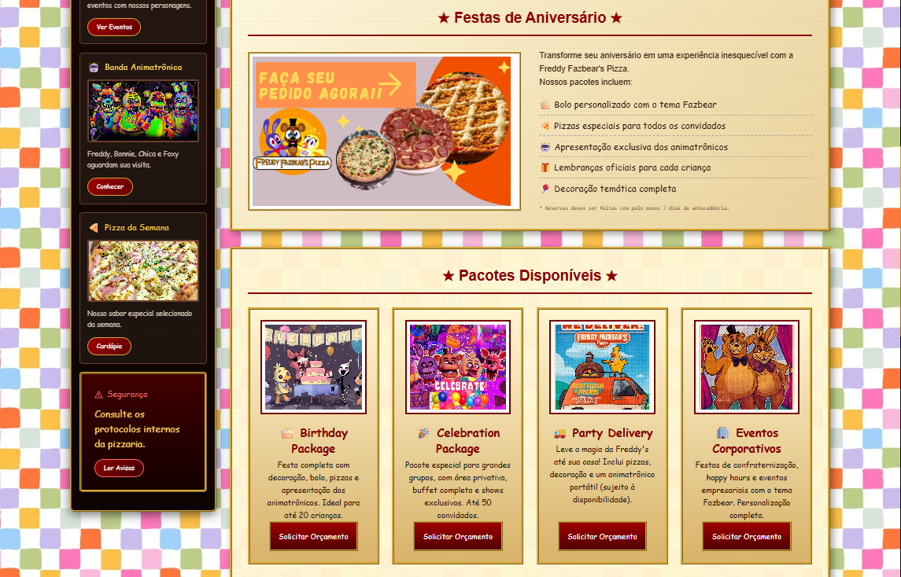

# 🍕 Freddy Fazbear's Pizza — Fan Website Project


> Um projeto fictício inspirado no universo de **Five Nights at Freddy's (FNaF)**, recriando um antigo portal corporativo da Freddy Fazbear's Pizza Entertainment.

---

# 📌 Sobre o projeto

**Freddy Fazbear's Pizza — Fan Website Project** é um projeto front-end inspirado na franquia **Five Nights at Freddy's**.

O objetivo é simular um antigo site empresarial de uma rede de pizzarias dos anos 90/2000, combinando:

* 🍕 identidade visual de restaurantes antigos;
* 📺 estética vintage;
* 📁 arquivos corporativos fictícios;
* 🤖 personagens animatrônicos;
* 🔒 sistemas internos;
* 📷 galerias e registros históricos;
* 🖥️ experiência de portal empresarial retrô;
* 🏪 registros visuais da banca promocional da pizzaria;
* 🎪 materiais de divulgação e decoração da unidade.

O projeto foi desenvolvido como:

* estudo de desenvolvimento web;
* prática de organização profissional de projetos;
* criação de interfaces temáticas;
* experimentação com HTML, CSS e JavaScript.

---

# ⚠️ Aviso

Este projeto é um **fan project sem fins comerciais**.

Ele:

✅ não é oficial;
✅ não possui ligação com a franquia original;
✅ não representa uma empresa real;
✅ foi criado apenas para estudo e entretenimento.

Todos os direitos relacionados a **Five Nights at Freddy's**, personagens e marcas pertencem aos seus respectivos proprietários.

---

# 🖼️ Screenshots

Algumas imagens do projeto:

## Página inicial



---

## Interface do sistema



---

## Página interna



---

# 🏪 Banca promocional

O projeto também inclui registros visuais de uma banca promocional fictícia da Freddy Fazbear's Pizza.

Essas imagens representam:

* estandes promocionais;
* materiais publicitários;
* decoração temática;
* elementos visuais da marca.

Localização:

```
assets/imagens/banca/
```

---

# 🚀 Como executar

## Requisitos

Necessário:

* Visual Studio Code;
* Live Server ou outro servidor local;
* Navegador moderno.

---

## Instalação

Clone o projeto:

```bash
git clone URL_DO_REPOSITORIO
```

Entre na pasta:

```bash
cd pizzaria_fnaf
```

A estrutura principal deve conter:

```
index.html
assets/
components/
css/
js/
data/
paginas/
```

---

## Executando

Abra:

```
index.html
```

No Visual Studio Code:

```
Botão direito
→ Open with Live Server
```

ou:

```
Go Live
```

---

## ⚠️ Importante

Não abra diretamente:

```
file:///C:/projeto/index.html
```

O projeto utiliza carregamento dinâmico de componentes:

* header;
* navbar;
* sidebar;
* footer.

Esses componentes são carregados através de JavaScript e precisam de um servidor local.

---

# 🌐 Páginas disponíveis

# 🏠 Index

Página principal da Freddy Fazbear's Pizza.

Inclui:

* banner principal;
* apresentação da empresa;
* serviços;
* promoções;
* cards de experiência;
* pizzas;
* animatrônicos;
* posters;
* história.

---

# 🍕 Restaurante

## Menu

Sistema de cardápio da pizzaria.

Inclui:

* pizzas;
* bebidas;
* produtos especiais.

Os dados são carregados utilizando JSON.

---

## Pizzas

Catálogo de sabores:

* tradicionais;
* especiais;
* sabores exclusivos;
* pizzas comemorativas.

---

## Pedidos

Sistema fictício de pedidos.

Possui:

* envio de informações;
* armazenamento local;
* gerenciamento futuro.

---

# 🤖 Animatrônicos

Catálogo dos personagens da pizzaria.

Inclui:

* Freddy Fazbear;
* Bonnie;
* Chica;
* Foxy;
* Golden Freddy.

Possui:

* imagens;
* informações;
* apresentações individuais.

---

# 📜 História

Área dedicada aos registros históricos da empresa.

Inclui:

* fundação;
* expansão;
* eventos antigos;
* arquivos corporativos.

---

# 📰 Notícias

Sistema de comunicados fictícios.

Inclui:

* anúncios;
* atualizações;
* informações internas.

---

# 📁 Arquivos

Área de documentos internos.

Inclui:

* relatórios;
* registros;
* arquivos confidenciais;
* documentos históricos.

---

# 🔒 Segurança

Página baseada em protocolos internos.

Inclui:

* regras da pizzaria;
* segurança dos funcionários;
* monitoramento;
* procedimentos de emergência.

---

# 👥 Funcionários

Área administrativa fictícia.

Inclui:

* informações internas;
* setores;
* registros de funcionários.

---

# 🛡️ Área administrativa

O projeto possui páginas administrativas internas.

## Administração de candidaturas

Arquivo:

```
admin-candidaturas.html
```

Função:

* gerenciamento fictício de candidatos;
* registros internos de funcionários.

---

## Administração de pedidos

Arquivo:

```
admin-pedidos.html
```

Função:

* visualização de pedidos;
* gerenciamento interno.

---

# 📷 Galeria

Sistema de galeria visual.

Inclui:

* fotos dos animatrônicos;
* posters promocionais;
* imagens da pizzaria;
* arquivos históricos;
* registros de câmeras;
* imagens da banca promocional.

Recursos:

* filtros por categoria;
* visualizador de imagens;
* layout responsivo.

Categorias:

```
Animatronics
Posters
Pizzaria
Banca
Extras
```

---

# 📞 Contato

Página de comunicação fictícia.

Inclui:

* formulário;
* informações da empresa;
* integração JavaScript.

---

# 🏗️ Estrutura do projeto

```text
.
├── assets/
│   ├── fonts/
│   │   ├── BowlbyOneSC-Regular.ttf
│   │   ├── Creepster-Regular.ttf
│   │   ├── PressStart2P-Regular.ttf
│   │   ├── Rye-Regular.ttf
│   │   └── SpecialElite-Regular.ttf
│   │
│   └── imagens/
│       ├── anuncios/
│       ├── background/
│       ├── backgrounds-site/
│       ├── banners/
│       ├── banca/
│       ├── characters/
│       │   ├── animatronics/
│       │   ├── carousel-posters/
│       │   ├── desenho-criancas/
│       │   └── pelucias/
│       │
│       ├── icons/
│       ├── jogo/
│       ├── logos/
│       ├── pizzas/
│       └── screenshots/
│           └── site/
│
├── components/
│   ├── header.html
│   ├── navbar.html
│   ├── sidebar.html
│   ├── footer.html
│   │
│   ├── cards/
│   └── sections/
│
├── css/
│   ├── animations.css
│   ├── arquivos.css
│   ├── components.css
│   ├── fonts.css
│   ├── footer.css
│   ├── header.css
│   ├── menu.css
│   ├── navbar.css
│   ├── pages.css
│   ├── sidebar.css
│   ├── style.css
│   └── vintage.css
│
│   └── pages/
│       ├── animatronics.css
│       ├── arquivos.css
│       ├── contato.css
│       ├── contratando.css
│       ├── eventos.css
│       ├── galeria.css
│       ├── historia.css
│       ├── index.css
│       ├── menu.css
│       ├── noticias.css
│       ├── pedidos.css
│       ├── pizzas.css
│       └── seguranca.css
│
├── data/
│   ├── menu.json
│   └── orders.json
│
├── js/
│   ├── core/
│   │   ├── audio.js
│   │   ├── effects.js
│   │   └── main.js
│   │
│   └── pages/
│       ├── arquivos.js
│       ├── contato.js
│       ├── contratando.js
│       ├── eventos.js
│       ├── galeria.js
│       ├── menu.js
│       ├── navbar.js
│       ├── order.js
│       ├── pedidos.js
│       ├── pedidos-salvos.js
│       ├── secrets.js
│       └── seguranca.js
│
├── paginas/
│   ├── animatronics.html
│   ├── arquivos.html
│   ├── contato.html
│   ├── contratando.html
│   ├── eventos.html
│   ├── funcionarios.html
│   ├── galeria.html
│   ├── historia.html
│   ├── menu.html
│   ├── noticias.html
│   ├── pedidos.html
│   ├── pizzas.html
│   └── seguranca.html
│
├── admin-candidaturas.html
├── admin-pedidos.html
├── index.html
├── LICENSE
└── README.md
```

---

# 🛠️ Tecnologias utilizadas

## Front-end

* HTML5;
* CSS3;
* JavaScript.

---

# ⚙️ Recursos utilizados

* Componentização HTML;
* CSS modular;
* JavaScript separado por páginas;
* JSON externo;
* Fontes personalizadas;
* Animações CSS;
* Layout responsivo;
* Sistema de filtros;
* Visualizadores de imagens;
* Manipulação de DOM;
* Carregamento dinâmico de componentes.

---

# 🎨 Identidade visual

O projeto utiliza inspiração em:

* sites antigos de empresas;
* páginas promocionais dos anos 90;
* sistemas corporativos;
* documentos internos;
* publicidade vintage;
* estandes promocionais.

A intenção é criar a sensação de acessar um antigo sistema perdido da **Fazbear Entertainment**.

---

# 🖼️ Créditos

As imagens utilizadas podem incluir:

* materiais de referência;
* artes de fãs;
* imagens públicas;
* elementos inspirados na franquia.

Os direitos pertencem aos seus respectivos criadores.

Caso algum autor deseje:

* receber créditos;
* corrigir informações;
* solicitar remoção;

entre em contato.

---

# 🎯 Objetivos do projeto

Este projeto pratica:

* Desenvolvimento Front-End;
* Organização profissional de arquivos;
* Criação de interfaces temáticas;
* Responsividade;
* Componentização;
* Manipulação de DOM;
* Sistemas interativos;
* Estruturação de grandes projetos web.

---

# 📜 Licença

O código desenvolvido segue a licença presente neste repositório.

Personagens, marcas e imagens de terceiros permanecem protegidos por seus respectivos direitos autorais.

---

# ⭐ Considerações finais

A **Freddy Fazbear's Pizza** foi recriada como uma experiência web fictícia, simulando um antigo portal corporativo encontrado no tempo.

O objetivo é transformar uma simples página em uma experiência completa envolvendo:

🍕 restaurante;

🤖 animatrônicos;

📁 arquivos;

📷 memórias;

🏪 banca promocional;

🔒 mistérios;

🖥️ tecnologia retrô.

Obrigado a todos que inspiraram este projeto. 🍕🤖
