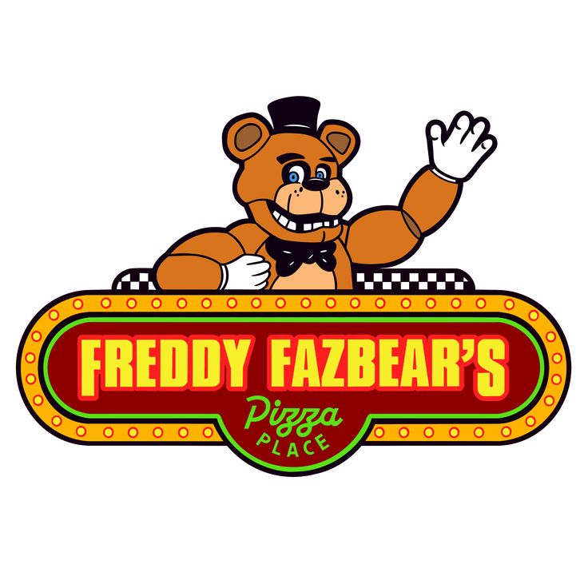

# 🍕 Freddy Fazbear's Pizza - Official Website (Fan Project)



## 📌 Sobre o projeto

Este projeto é uma recriação fictícia do site oficial da **Freddy Fazbear's Pizza**, inspirado no universo de **Five Nights at Freddy's (FNaF)**.

A proposta é criar um site com aparência de uma página corporativa antiga, misturando elementos de:

- sites empresariais dos anos 90/2000;
- estética vintage;
- páginas de pizzaria;
- arquivos internos e documentos fictícios;
- elementos de terror e mistério.

O projeto é desenvolvido como um **fan project sem fins comerciais**.

---

# 🎮 Conteúdo

O site possui páginas como:

- 🏠 Página inicial
- 🍕 Cardápio de pizzas
- 🎉 Eventos e aniversários
- 🤖 Animatronics
- 📜 História da empresa
- 📰 Notícias
- 📁 Arquivos internos
- 👥 Funcionários
- 🔒 Segurança
- 📷 Galeria
- 📞 Contato
- 📝 Pedidos

---

# 🗂️ Estrutura do projeto

```
.
├── assets/
│   ├── audio/
│   ├── documentos/
│   ├── fonts/
│   └── imagens/
│
├── components/
│   ├── header.html
│   ├── navbar.html
│   ├── sidebar.html
│   ├── footer.html
│   ├── cards/
│   └── sections/
│
├── css/
│   ├── style.css
│   ├── components.css
│   ├── pages.css
│   └── animations.css
│
├── data/
│   ├── menu.json
│   └── orders.json
│
├── js/
│   ├── core/
│   └── pages/
│
├── paginas/
│   ├── animatronics.html
│   ├── historia.html
│   ├── menu.html
│   └── outras páginas
│
└── index.html
```

---

# 🖼️ Créditos das imagens

Este projeto utiliza imagens provenientes de diferentes fontes encontradas na internet, incluindo:

- fanarts;
- desenhos de fãs;
- artes compartilhadas em comunidades;
- imagens de referência encontradas no Pinterest.

Essas imagens **não foram criadas pelo desenvolvedor deste projeto**.

Todos os direitos das artes pertencem aos seus respectivos criadores.

Caso você seja o autor de alguma imagem utilizada e queira solicitar:

- crédito adequado;
- alteração da atribuição;
- remoção da imagem;

entre em contato.

---

# ⚠️ Aviso de direitos autorais

Five Nights at Freddy's, Freddy Fazbear's Pizza, seus personagens e elementos relacionados pertencem aos seus respectivos detentores de direitos.

Este projeto:

- não possui ligação oficial com a franquia;
- não representa uma página oficial;
- não possui finalidade comercial;
- foi criado apenas para fins de estudo, programação e demonstração.

---

# 🛠️ Tecnologias utilizadas

- HTML5
- CSS3
- JavaScript
- JSON
- Fontes personalizadas
- Componentização de páginas

---

# 🎨 Objetivos do projeto

O objetivo principal é praticar:

- desenvolvimento front-end;
- organização de projetos web;
- criação de interfaces temáticas;
- reutilização de componentes;
- manipulação de dados externos;
- criação de experiências imersivas.

---

# 📜 Licença

O código desenvolvido neste projeto pode ser estudado e reutilizado conforme os termos definidos na licença deste repositório.

As imagens, artes e personagens de terceiros permanecem sob os direitos de seus respectivos autores.

---

# ⭐ Observação final

Este é um projeto feito por fã, para fãs.
Obrigado a todos os artistas que criaram as artes utilizadas como inspiração para este site.